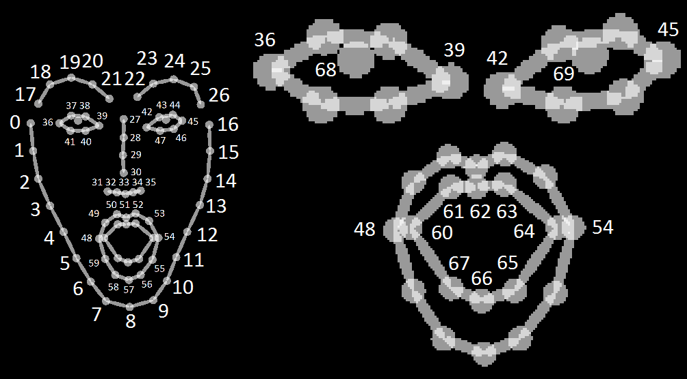

# ASLLVD-Skeleton Dataset Preprocessing

This project aims to process the ASLLVD database to create the **ASLLVD-Skeleton** database. For details on the database and processing steps, check the links below.

[[ST-GCN for Sign Language Paper]](http://www.cin.ufpe.br/~cca5/st-gcn-sl/paper/)

[[ASLLVD-Skeleton Website]](http://www.cin.ufpe.br/~cca5/asllvd-skeleton/)

[[ASLLVD-Skeleton-20 Website]](http://www.cin.ufpe.br/~cca5/asllvd-skeleton-20/)


## Installation

After checkout the project, run the following command to install and get the required libraries
```
bash setup.sh 
```


## Preprocessing

To preprocess ASLLVD dataset, run
```
python main.py preprocessing -c config/preproc-27.yaml [--work_dir <work folder>]
```
The training results, configurations and logging files, will be saved under the ```./work_dir``` by default or ```<work folder>``` if you appoint it.

You can modify the preprocessing parameters in the command line or configuration files. The order of priority is:  command line > config file > default parameter. For more information, use ```main.py -h```.


## Configuration

Details on how to configure preprocessing can be obtained below

[config/](config/)


## Keypoints estimation (OpenPose)

When estimating keypoints, OpenPose provides a JSON similar to the example below. 

```
{
    "version":1.1,
    "people":[
        {
            "pose_keypoints_2d":[582.349,507.866,0.845918,746.975,631.307,0.587007,...],
            "face_keypoints_2d":[468.725,715.636,0.189116,554.963,652.863,0.665039,...],
            "hand_left_keypoints_2d":[746.975,631.307,0.587007,615.659,617.567,0.377899,...],
            "hand_right_keypoints_2d":[617.581,472.65,0.797508,0,0,0,723.431,462.783,0.88765,...]
            "pose_keypoints_3d":[582.349,507.866,507.866,0.845918,507.866,746.975,631.307,0.587007,...],
            "face_keypoints_3d":[468.725,715.636,715.636,0.189116,715.636,554.963,652.863,0.665039,...],
            "hand_left_keypoints_3d":[746.975,631.307,631.307,0.587007,631.307,615.659,617.567,0.377899,...],
            "hand_right_keypoints_3d":[617.581,472.65,472.65,0.797508,472.65,0,0,0,723.431,462.783,0.88765,...]
        }
    ],
    // If `--part_candidates` enabled
    "part_candidates":[
        {
            "0":[296.994,258.976,0.845918,238.996,365.027,0.189116],
            "1":[381.024,321.984,0.587007],
            "2":[313.996,314.97,0.377899],
            "3":[238.996,365.027,0.189116],
            "4":[283.015,332.986,0.665039],
            "5":[457.987,324.003,0.430488,283.015,332.986,0.665039],
            "6":[],
            "7":[],
            "8":[],
            "9":[],
            "10":[],
            "11":[],
            "12":[],
            "13":[],
            "14":[293.001,242.991,0.674305],
            "15":[314.978,241,0.797508],
            "16":[],
            "17":[369.007,235.964,0.88765]
        }
    ]
}
```

### Body parts estimation sequence:

The sequence in which body parts are disposed in OpenPose JSON is as follows. Its index and description are detailed in the next sections:
* Pose (or body)
* Face
* Hands
    * Left
    * Right

#### Body

<p>
    
</p>

| Keypoints | JSON Index | Body Part |
|-----------|------------|-----------|
| 0 - 1     | 0 - 1      | Neck      |
| 2 - 4     | 2 - 4      | Right arm |
| 5 - 7     | 5 - 7      | Left arm  |
| 8 - 10    | 8 - 10     | Right leg |
| 11 - 13   | 11 - 13    | Left leg  |
| 14 - 17   | 14 - 17    | Head      |


#### Head

<p>
    
</p>

| Keypoints | JSON Index | Body Part     |
|-----------|------------|---------------|
| 0 - 16    | 18 - 34    | Face          |
| 17 - 21   | 35 - 39    | Right eyebrow |
| 22 - 26   | 40 - 44    | Left eyebrow  |
| 27 - 35   | 45 - 53    | Nose          |
| 36 - 41   | 54 - 59    | Right eye     |
| 42 - 47   | 60 - 65    | Left eye      |
| 48 - 67   | 66 - 85    | Mouth         |
| 68        | 86         | Right eyeball |
| 69        | 87         | Left eyeball  |


#### Left Hand

<p>
    
</p>

| Keypoints | JSON Index | Body Part     |
|-----------|------------|---------------|
| 0         | 88         | Wrist         |
| 1 - 4     | 89 - 92    | Thumb finger  |
| 5 - 8     | 93 - 96    | Index finger  |
| 9 - 12    | 97 - 100   | Middle finger |
| 13 - 16   | 101 - 104  | Ring finger   |
| 17 - 20   | 105 - 108  | Little finger |

#### Right Hand

<p>
    
</p>

| Keypoints | JSON Index | Body Part     |
|-----------|------------|---------------|
| 0         | 109        | Wrist         |
| 1 - 4     | 110 - 113  | Thumb finger  |
| 5 - 8     | 114 - 117  | Index finger  |
| 9 - 12    | 118 - 121  | Middle finger |
| 13 - 16   | 122 - 125  | Ring finger   |
| 17 - 20   | 126 - 129  | Little finger |


## Citation
Please cite the following paper if you use this repository in your reseach.
```
@article{stgcnsl2019,
  title     = {Spatial-Temporal Graph Convolutional Networks for Sign Language Recognition},
  author    = {Cleison Correia de Amorim and David Macêdo and Cleber Zanchettin},
  year      = {2019},
}
```

## Contact
For any question, feel free to contact me at
```
Cleison Amorim  : cca5@cin.ufpe.br
```
